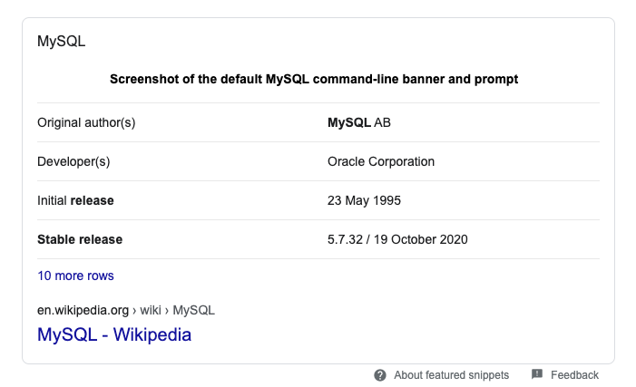

# Mysql

Mysql is a basic Database to store countless data. It is RDMS(Relation is more more more important structure). You can Read, Create, Update, delete data with it. faster, managable (like transaction) than FileSystem.
It is manage by Oracle. And can get good performance in

Espectially 5.7 version is stable version. So industry use this version for development or testing.



If you want get more information [click this](https://mysql.com)

# Docker

Docker is a virtualization program. It is usally show more performance than any other virtualization machine program. Becase It use container. So, It can make more efficient feature.

If you want get more information [click this](https://www.docker.com/)

### Install

Following That
https://www.docker.com/get-started

# Mysql with Docker

### Just Run script.

```bash
sudo docker run \ # run container
 -e MYSQL_ROOT_PASSWORD=qwe123 \ # setting MYSQL_ROOT_PASSWORD
 -e MYSQL_DATABASE=just \ # default database name
 -e TZ=Asia/Seoul \ # setting Timezone
 -p 3309:3306 \ # setting port (my Pc port:container port)
 mysql:5.7 \ # image name
 --character-set-server=utf8 \ # setting utf8
 --collation-server=utf8_unicode_ci # setting utf8
```

more information => https://docs.docker.com/get-started/

### With compose file

docker-compose.yml

```yml
version: "3.7"
services:
  # Mysql Server
  db:
    image: mysql:5.7
    # mysql utf-8 설정
    command:
      - --character-set-server=utf8
      - --collation-server=utf8_unicode_ci
    # db password 및 db 자동 생성
    environment:
      MYSQL_ROOT_PASSWORD: "qwe123"
      MYSQL_DATABASE: "just"
      MYSQL_TCP_PORT: "3306"
      TZ: "Asia/Seoul"
    ports:
      - "3309:3306"
    # for db data backUp
    volumes:
      - ./mysql/data:/var/lib/mysql
```

```bash
docker-compose up --build
```

more infomation => https://docs.docker.com/compose/
